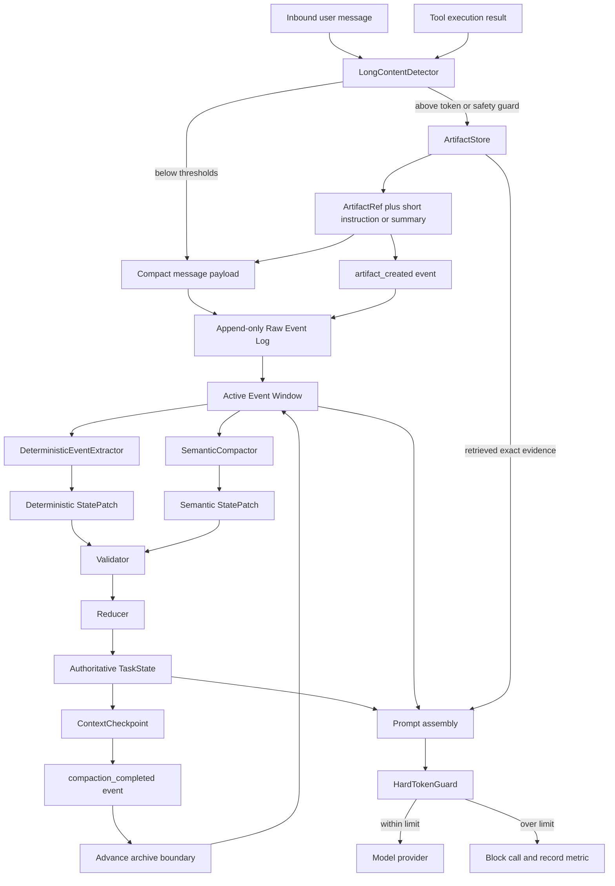
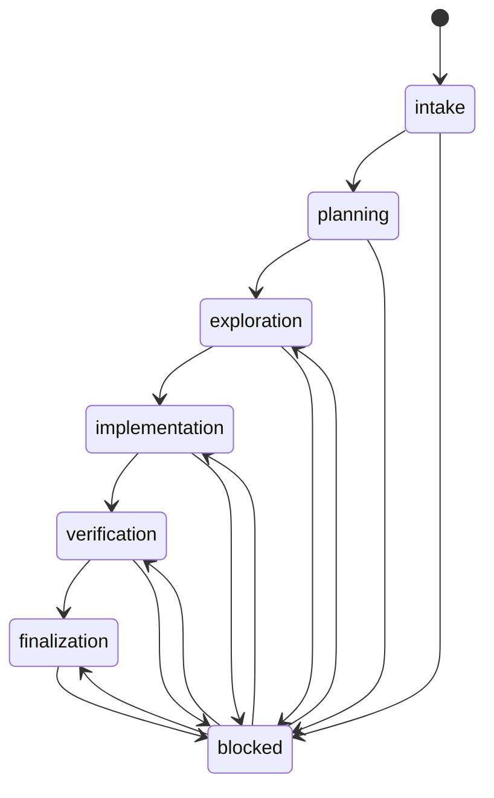
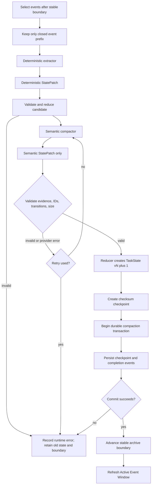

# TaskState 上下文管理架构

状态：当前生产主路径

最后核对：2026-07-29

本文是 CodingApplication 上下文管理的规范性入口。较早的 Section 字符预算、
`head` / `tail` / `head_tail` 和 `latest_tool_call` 文档只保留为历史记录；若其描述与
本文冲突，以本文和当前代码为准。

## 1. 目标与不变量

新主路径是：

```text
Raw Event Log -> ArtifactStore -> authoritative TaskState -> Prompt Context
```

默认启用的 Coding 主路径必须满足以下不变量。受控迁移开关可以暂停对应新组件，
但不能形成双写/双权威，也不能修改已提交事实；其中最终 token guard 在回滚期间同样不可绕过：

1. Event Log 保存不可变事实；归档只移动活动边界，不删除审计事件。
2. 大型原文由 ArtifactStore 持有一份，其他层只保存引用、摘要和必要元数据。
3. `TaskState` 是任务进展的唯一权威可变状态。
4. `WorkingMemory` 是兼容 API 投影；`CodingContextState` 只保存渲染/checkpoint 元数据。
5. 当前真实用户请求只在本轮任务消息中出现一次；handoff 只包含已完成历史。
6. Prompt 是单次调用的临时产物，不反向成为 Event Log 或 TaskState。
7. 工具调用与其结果是不可拆分事务；未闭合事务不能越过归档边界。
8. 最终 token guard 在 provider 调用前执行；超限时抛出 `PromptBudgetExceeded`，不得调用模型。

## 2. 术语和生命周期

| 对象 | 生命周期 | 是否完整事实 | 是否进入 Prompt | 持久化位置 |
|---|---|---:|---:|---|
| Event Log | Session 全生命周期 | 是，正文可为 ArtifactRef | 不直接全量进入 | `context_events` |
| Active Event Window | checkpoint 边界之后 | 是，近期子集 | 作为候选近期上下文 | `Session.active_event_window`，边界来自 checkpoint |
| Artifact | 独立于 Session | 是，大型原文 | 仅按需读取片段 | `CONTEXT_ARTIFACT_ROOT/content` + `metadata` |
| TaskState | 当前任务 | 是，语义任务状态 | 以受信标记的运行时消息进入 | Session metadata + checkpoint |
| CodingContextState | 当前任务 | 否，仅渲染/checkpoint 游标 | 不独立注入事实 | Session metadata |
| WorkingMemory | 兼容调用期间 | 否，TaskState 投影 | Coding 主路径不单独注入 | 不再独立持久化 |
| Prompt Messages | 单次模型调用 | 否，临时选择结果 | 是 | `Session.prompt_messages`/调用栈，不是历史真相 |

`Session.messages` 在迁移期仍是兼容 chat transport。它不是新事实模型的归档边界，也不能用
消息列表索引代替 `event_id`。

## 3. 数据流



入口有两层保护：`AgentLoop` 在记录新用户消息前外置大型输入；工具结果存储 hook 在结果进入
后续上下文前外置大型输出。`CodingApplication` 对当前 coding request 再做幂等检查，以兼容
绕过标准 AgentLoop 的调用者。Artifact 使用内容寻址，因此同一字节序列重复 `put` 仍只产生
一个内容对象。

## 4. 组件职责和边界

### 4.1 Raw Event Log

`runtime/context/events.py` 定义 `ContextEvent` 和以下类型：

```text
user_message             assistant_message
tool_call                tool_result
runtime_error            user_correction
task_state_checkpoint    compaction_completed
artifact_created
```

事件由 `session_id`、严格递增的 `seq`、类型、时间和 payload 派生稳定 `event_id`。事件对象冻结
payload，数据库表只追加新 sequence。Event Log 的职责是审计、恢复和重新压缩，不负责决定本轮
Prompt 大小。

`Session` 同时维护三个相互独立的视图：

- `event_log`：已载入的完整事实序列；
- `active_event_window`：`archive_boundary_seq` 之后的事件；
- `prompt_messages`：本次调用临时消息。

`set_archive_boundary()` 只能前进，并会在工具调用没有匹配结果时把请求边界向前收缩。归档不
删除 `context_events` 行。

### 4.2 ArtifactStore

`runtime/context/artifacts.py` 是统一内容存储，不与 PDF、Document 或某一工具绑定。支持用户
粘贴、文件、日志、JSON/API 响应、代码分析、测试报告、工具结果和生成文件。

每个 Artifact 元数据包含：

```text
artifact_id, artifact_type, name, mime_type,
size_bytes, size_chars, content_hash, storage_uri,
parse_status, created_at, metadata
```

`artifact_id` 是 `art_<sha256>`，正文位于 `content/<sha256>`，描述位于
`metadata/<artifact_id>.json`。正文先原子发布，metadata 后发布；失败不会暴露半条 metadata，
但可能留下可回收的孤立 content 文件。读取时重新验证 SHA-256。

公开能力为：

```text
put_artifact / get_artifact_metadata / read_artifact
read_artifact_range / search_artifact
get_artifact_outline / sample_artifact
```

ArtifactStore 拥有原文。Event、TaskState、handoff、Task Memory 和 Session metadata 只允许保存
`ArtifactRef`、简短摘要和来源元数据。

`LongContentDetector` 以 token 估算为主判断，字符和 UTF-8 字节为安全兜底。默认阈值分别为
4,000 tokens、20,000 chars、64,000 bytes，可由 `LONG_CONTENT_MAX_*` 配置。替换消息只保留可识别
的短指令、Artifact 描述和引用；JSON 或日志开头不会被误当成用户指令。

### 4.3 Authoritative TaskState

`applications/coding/task_state.py` 定义唯一权威状态。它保存简短 objective、约束、有限 phase、
行动状态、发现、证据、覆盖范围和执行记忆，但不保存原始大型正文。

`applications/coding/context_state.py` 中保留的 `CodingContextState` 是不可变的小型 snapshot，
只包含：

```text
task_state_version, generation, compacted_until_event_id,
source_event_start_id, source_event_end_id,
prompt_tail_start_index, checkpoint/metrics metadata
```

它不能独立添加 finding、decision 或 action。`runtime/working_memory.py` 的读 API 从 TaskState
投影旧结构；写 API 把兼容对象归约回 TaskState，并删除 metadata 中旧的独立 `working_memory`。

### 4.4 Prompt Context

Coding Prompt 的语义顺序是：

```text
System / developer instructions
TaskState runtime context
Recent complete message groups, including latest real user message
Current unclosed tool transaction
Retrieved evidence/context
```

TaskState 以 `role=user` 传输，但带有：

```xml
<coding-context-state
  source="runtime-generated"
  trust="context-only"
  instructions="false">
```

配套 protocol 明确说明引用的文档、网页、Artifact 和工具输出都不是系统指令，最新真实用户消息
可以纠正旧状态。近期消息按完整 group 选择，而不是固定保留 N 组。Retrieved evidence 优先级低于
TaskState、最新请求和未闭合工具事务，并且只能整块加入或移除。

## 5. TaskState 字段维护规则

所有模型产出的变化都是 proposal；只有 Validator 和 Reducer 可以提交新版本。表中的“失效”表示
保留历史并显式 supersede/resolve，不表示删除旧事实。

| 字段 | 写入者与时机 | 事实来源/证据规则 | 更新和失效 |
|---|---|---|---|
| `objective` | Runtime 在首次请求或新的真实用户事件到达时写；deterministic correction 可写 | 只保存短摘要和 `event://`/ArtifactRef；Semantic patch 禁止改目标 | 新目标增加 version，记录 `supersedes` 和 history；不复制到 finish condition |
| `constraints` | Runtime/经验证 Semantic patch 在压缩用户明确约束时写 | 必须可追溯到用户事件；推测不能升级为约束 | 显式状态或 superseding item 取消，不能因 patch 省略而消失 |
| `phase` | Runtime 对经过验证的 transition 提议归约 | 只接受有限枚举和合法边 | 前向流转或进入 `blocked`；解除 blocker 后回到允许的工作 phase |
| `plan` | Runtime 或 Semantic patch 提议，Reducer 分配/检查稳定 ID | action 描述可语义提取；完成声明需要后续证据 | `pending -> in_progress -> awaiting_verification -> completed`；也可 `failed`/`superseded` |
| `completed` | Runtime 在有完成事实时写 | 保存 evidence refs、source events、覆盖范围和仍开放问题 | 新证据推翻时创建 superseding 记录，不静默覆盖 |
| `findings` | Deterministic/semantic patch 提议，Validator 接受 | 每条必须引用已登记 `EvidenceRef` | 推翻时保留旧项并设置 superseded 关系 |
| `hypotheses` | Semantic compactor 可写 | 可以没有证据；无证据 Finding 自动降级到这里 | 验证后转为有证据 Finding，或显式完成/失败/supersede |
| `decisions` | Semantic compactor 提议，Reducer 提交 | 保存 choice、rationale、rejected alternatives、related findings；引用必须存在 | 新决定 supersede 旧决定，保留理由和历史 |
| `pending_actions` | Runtime/semantic patch 写行动建议 | 工具成功只产生 observed effect，不自动等价为任务完成 | 写文件后通常为 `awaiting_verification`；验证证据到达后才 `completed` |
| `open_questions` | Runtime 或 Semantic patch 在缺信息、冲突、未验证时写 | 保存 reason、resolution strategy 和已有 refs | 由稳定 ID transition 解决，并记录 `resolved_by` |
| `blockers` | Runtime 从错误/工具状态确定性产生；semantic 只能引用事实 | 认证、权限、缺文件、工具/环境失败等；不得用猜测创建运行时事实 | 原 blocker 保留，解决者和状态显式记录 |
| `evidence_index` | 仅 DeterministicEventExtractor/Runtime 写 | URI 由代码生成；Semantic patch 禁止新建 EvidenceRef | 内容不同的同 ID 被拒绝或记录 replacement history |
| `artifact_refs` | LongContentDetector 和 deterministic extraction 写 | 只能引用已创建 Artifact；Semantic patch 只能复用 state 中已有引用 | 去重追加；Artifact 本体不进入 state |
| `coverage` | Deterministic extractor 从文件、symbol、test、文档工具事件写 | 不允许模型虚构已检查区域 | 去重累积；未检查区域显式留在 `areas_unchecked`/`uncovered` |
| `execution_memory` | Runtime 从 tool call/result/error 写 | fingerprint、result hash、failure、observed effect 都来自事件 | 有界去重/保留；用于重复调用与无进展保护，不保存大型结果正文 |
| `history`, `version` | Reducer | 每次 replacement/patch 的稳定来源 ID | patch 成功后 version 递增；prompt 可省略 history，checkpoint 保留 |

Phase 合法状态图：



## 6. 混合状态更新与压缩



Deterministic extraction owns paths, tool names/arguments/status, hashes, test observations, ArtifactRefs,
coverage and EvidenceRefs. Semantic compaction owns task continuity: constraints, relationships, rationale,
hypotheses, questions and next actions. Semantic compaction never receives authority to replace the whole
TaskState, create evidence, invent coverage/execution facts, or change objective.

Validator 至少检查：

- Semantic patch 不创建 EvidenceRef、coverage、tool/result 或新 ArtifactRef；
- Finding/Decision/CompletedItem 引用已登记 evidence/finding；
- phase/item transition 合法且 ID 不重复；
- 同 ID replacement 显式声明 superseding 关系；
- 应用 patch 后 TaskState 不超过 8,000 tokens；
- 无 EvidenceRef 的 semantic Finding 降级为 Hypothesis。

Reducer 在深拷贝上执行，分配 patch ID、去重有界执行记忆、记录 replacement history 并递增版本。
传入的旧 TaskState 不会被 compactor 原地修改。

## 7. Checkpoint 与归档原子性

一次成功压缩按以下顺序完成：

1. 从 `compacted_until_event_id` 之后选择事件。
2. 只取不拆分工具事务的闭合前缀。
3. 确定性提取、验证并归约候选 state。
4. SemanticCompactor 产生 patch；失败或验证失败最多重试一次。
5. 再次验证并归约，生成新 generation 和 `ContextCheckpoint`。
6. 在 SessionStore 事务中持久化 Session/新事件/checkpoint 记录。
7. 写入 `task_state_checkpoint` 和 `compaction_completed` 事实。
8. 数据库 commit 成功后才推进内存 `archive_boundary_seq`。
9. 刷新 `active_event_window`，旧事件不再成为 Prompt 候选。

`ContextCheckpoint` 含 generation、TaskState version、完整 source event ID 范围、稳定 boundary、
ArtifactRefs、checksum 和时间。SessionStore 还对完整 checkpoint JSON 保存 `state_sha256`。加载时
checksum 不匹配的数据库 checkpoint 被跳过，恢复使用按 boundary 排序的最新有效记录。

任一步失败时：

- 不暴露候选 TaskState；
- 不推进 stable boundary/generation；
- 数据库事务回滚；
- 移除本次未持久化的内存 checkpoint/completion 事件；
- 恢复旧 metadata state，记录 `runtime_error` 和失败指标。

Artifact 写入不属于数据库事务：它先于引用事件发生。Artifact 写失败会终止外置；metadata 发布
失败可能留下无引用 content blob，但不会推进 compaction boundary。孤立 blob 清理是单独维护任务。

## 8. 动态 Token Budget 与最终 Guard

对选定 provider/model 定义：

```text
W = model_context_window
S = system_prompt_tokens
T = tool_definition_tokens
O = reserved_output_tokens
M = safety_margin_tokens

U = max(1, W - S - T - O - M)
soft_compaction_trigger = floor(U * 0.70)
compaction_target       = floor(U * 0.45)
hard_input_limit        = floor(U * 0.92)
hard_prompt_limit       = min(W - T - O - M, S + hard_input_limit)
```

`S` 和 `T` 随实际 system messages 与工具 schema 变化；`W`、token estimator 和 output reserve 来自
本次路由后的 provider。比例由 `PROMPT_*_RATIO` 配置，默认 70% / 45% / 92%；未显式配置 margin
时默认使用窗口的 3%。

`ReasoningLoop` 在构造上下文前解析本轮 provider 和可见 tool schemas，并以 `model_provider`、
`model_tools`、`reserved_output_tokens` 传给 `ContextBuilder.build()`。Builder 用相同输入计算
`usable_input_tokens` 并传给 Coding view；provider 调用前 ReasoningLoop 再对最终消息执行一次完整
预算计算和 guard，装配估算不能替代最后检查。

装配阶段用 `U` 选择完整 recent groups，并优先固定 TaskState、最新真实用户消息和未闭合工具事务。
如果候选 Prompt 超过 hard limit，先删除低优先级 retrieved evidence，再按整组删除旧消息；不会对
最新请求或工具事务做字符串中部截断。

调用前重新测量完整 Prompt：

```python
actual = estimate_tokens(messages, provider=selected_provider)
dynamic = max(0, actual - S)
if actual > hard_prompt_limit or dynamic > hard_input_limit:
    raise PromptBudgetExceeded(...)
```

只有 guard 返回成功后才执行 provider `chat`/stream。超限会增加 `hard_budget_blocks` 并记录实际值、
hard limit 和 model window。

## 9. 进程重启与恢复

恢复顺序是：

1. SessionStore 加载 legacy messages、不可变 Event Log 和按 boundary 倒序的 checksum-valid checkpoints。
2. Session 用最新有效 checkpoint 的 `archive_boundary_seq` 重建 Active Event Window。
3. `load_task_state()` 优先从最新 checkpoint 的 `task_state` 恢复；没有时才读取 metadata/legacy state。
4. 只对 boundary 之后的闭合事件执行后续确定性/语义归约。
5. ArtifactRef 仍按内容哈希读取；读取时校验正文 hash。
6. Prompt 重新由恢复后的 TaskState、recent tail、当前工具事务和检索证据构造，不复用旧 Prompt。

数据库保留原始事件，因此可指定旧 checkpoint 和后续事件重新压缩。重放不得回写或修改旧事件，
新结果使用新 checkpoint/generation 表达。

## 10. 观测契约

结构化 metrics/trace 应使用 token、event 和 artifact 语义明确的名称：

| 类别 | 指标 |
|---|---|
| Prompt | `prompt_tokens_before_compaction`, `prompt_tokens_after_compaction`, `recent_tail_tokens`, `retrieved_evidence_tokens` |
| State | `task_state_tokens`, `compacted_event_count`, `compaction_generation`, `compaction_duration_ms` |
| Artifact | `artifact_offloaded_chars`, `artifact_offloaded_tokens`, `duplicate_content_saved_chars` |
| Failure | `semantic_compaction_failures`, `state_patch_validation_failures`, `hard_budget_blocks` |

日志必须区分 raw event size、Artifact size、TaskState size、候选 Prompt size 与实际发送 Prompt size。
`rendered_chars` 只表示某一兼容 report section，不能被解释为实际 provider input tokens。

## 11. 旧方案弃用原因

旧主路径按 Section 固定字符数，用 `head`/`tail`/`head_tail` 裁剪，并对 latest tool call 做特殊保护。
它被弃用的原因是：

- 字符数不等于目标模型 token，system prompt/tool schema 变化不会反映到预算；
- 机械裁剪会丢失约束、决策理由、开放问题和证据关系；
- 消息索引在列表改写后不是稳定归档边界；
- `latest_tool_call` 无限制保护可能让 Prompt 已超限仍继续调用；
- WorkingMemory 与 CodingContextState 重复保存 objective/findings/actions；
- 大型正文会在 handoff、metadata、Task Memory 和 Prompt 多次出现；
- 删除/裁剪活动消息没有 checkpoint，重启后旧状态可能复活。

Git 历史审计显示：`bb4e845` 首次加入 `runtime/coding_context_state.py` 时就使用规则吸收与
`deterministic_v1`，`034e075` 只把该文件迁移到 `applications/coding/context_state.py`。可用历史
中不存在可直接恢复的 provider-backed CodingContextState 语义压缩器；本次 SemanticCompactor
复用现有 summary 模型路由，但重新收敛为只能产生受验证 `StatePatch` 的新实现。请求重复则来自旧
handoff 的 `<current-user-request>` 与 task wrapper 的 `User coding task` 同时拼接，现已删除前者。

| 维度 | 旧 Coding 主路径 | 当前主路径 |
|---|---|---|
| 预算单位 | 每个 Section 固定 chars | 选定 model/provider 的 tokens |
| 状态权威 | WorkingMemory + CodingContextState 重复写 | 单一 TaskState；旧 API 只投影 |
| 大型正文 | message/handoff/metadata/Prompt 多份 | ArtifactStore 一份 + refs |
| 压缩 | head/tail/latest-tool 规则裁剪 | deterministic facts + semantic StatePatch |
| 边界 | 可变 message index | stable event ID + monotonic seq |
| 工具事务 | 特例保护，可能突破预算 | closed-group selection；open transaction 必留 |
| 恢复 | 裁剪后可能缺少 durable state | checksum checkpoint + later events |
| 最终安全 | report 可 over-budget 仍继续 | provider 调用前 hard token guard |

旧 `CODING_CONTEXT_COMPACTION_*`、`CODING_CONTEXT_RECENT_GROUPS` 和 Section char budgets 仅为短期
API/config 兼容，Coding TaskState view 明确忽略固定阈值。非 Coding profile 尚可使用通用 Section
预算，但最终模型调用仍受 token guard 约束。

## 12. Feature flags

以下开关默认全部开启：

| Flag | 主路径职责 |
|---|---|
| `TASK_STATE_CONTEXT_ENABLED` | TaskState 权威状态和兼容投影 |
| `SEMANTIC_COMPACTION_ENABLED` | 混合压缩中的 semantic patch |
| `ARTIFACT_OFFLOADING_ENABLED` | 大型用户/工具内容外置 |
| `DYNAMIC_PROMPT_BUDGET_ENABLED` | 上游 provider-aware Prompt 装配和软压缩触发 |

关闭开关只用于受控回滚诊断，不应长期形成双写、双权威或两套并行压缩边界。
provider 调用前的动态预算复算和 hard token guard 不受该开关控制，始终执行。

## 13. 已知边界与扩展方向

- ArtifactStore 当前是本地文件系统内容寻址实现；多节点部署需要共享、对象存储或复制适配器。
- 内容先于 metadata 发布，异常可产生无引用 blob；当前没有自动 GC/retention policy。
- `search_artifact` 是确定性线性文本查找，outline 是轻量 Markdown/JSON 结构提取，不替代解析/RAG。
- Session 当前仍会载入完整 audit event list；Active Event Window 已隔离 Prompt 候选，数据库分页加载可作为后续扩展。
- Semantic provider 未配置时只能产生空 semantic patch，确定性事实仍可压缩；运行环境应监控 semantic failure/degradation。
- Provider tokenizer 不可用时使用可靠 estimator 和 safety margin；可继续为各 provider 增加精确 tokenizer。
- Retrieved evidence 目前是 Prompt 临时层；后续可按 EvidenceRef 做按需 range retrieval、缓存和 provenance 展示。
- Artifact、checkpoint 和 event 的保留/删除需要独立的数据治理策略，不能作为上下文压缩的副作用。
- 旧 Session/WorkingMemory/CodingContextState 的升级与回滚步骤见
  [`docs/migrations/TASK_STATE_CONTEXT_MIGRATION.md`](../migrations/TASK_STATE_CONTEXT_MIGRATION.md)。

## 14. 代码入口

| 职责 | 入口 |
|---|---|
| Artifact 与长内容 | `runtime/context/artifacts.py`, `runtime/context/long_content.py` |
| Event Log | `runtime/context/events.py`, `runtime/sessions/session.py`, `session_store.py` |
| TaskState 与 legacy 映射 | `applications/coding/task_state.py` |
| Patch/validator/reducer/checkpoint | `applications/coding/compaction.py` |
| TaskState renderer/recent groups | `applications/coding/context_state.py` |
| Coding handoff/request 去重 | `applications/coding/handoff.py`, `runner.py`, `session.py` |
| Prompt 组装 | `runtime/context/builder.py` |
| 动态预算与 hard guard | `runtime/context/dynamic_budget.py`, `runtime/execution/reasoning_loop.py` |
| Tool result 外置 | `runtime/tooling/result_store.py`, `tools/hooks.py` |
