# TaleClaw 当前完整系统架构

> 基于 `refactor/agent-runtime-phase0-7` Phase 17 的本地代码。该图描述当前真实实现，
> 不是目标架构草图。

```mermaid
flowchart TB
    subgraph ENTRY["外部入口与适配器"]
        CLI["CLI"]
        WEB["Web Server"]
        TG["Telegram Worker"]
        FS["Feishu Worker"]
        VSC["VS Code / Scripts"]
        EVAL["Evaluation / SWE-bench"]
    end

    subgraph COMPOSE["Composition Root"]
        BOOT["runtime.bootstrap<br/>环境、模型、工具、插件与服务装配"]
    end

    subgraph DELIVERY["消息与应用入口"]
        APP["AppRuntime"]
        UBUS["User MessageBus<br/>Inbound / Outbound"]
        LOOP["AgentLoop<br/>接收、取消、路由、执行、投递"]
        ROUTER["AgentRouter<br/>IntentClassifier + ExecutionPlanner"]
        SESSION["SessionManager"]
        PLUGINS["PluginManager<br/>before_turn / after_turn / tool hooks"]
    end

    subgraph DEFINITIONS["声明与运行状态"]
        SPEC["AgentSpec<br/>ModelPolicy / ToolSet / ContextPolicy<br/>RunLimits / SpawnPolicy"]
        PLAN["ExecutionPlan<br/>runtime / coding_application / direct_reply"]
        RUNCTX["RunContext + RunState<br/>输入、取消、usage、trace、parent run"]
    end

    subgraph APPLICATIONS["应用编排层"]
        CHAT["Chat Application Path<br/>直接调用统一 Runtime"]

        subgraph CODING["CodingApplication"]
            CAPP["Coding Runner"]
            WORKSPACE["WorkspaceResolver<br/>Workspace boundary"]
            TASKSESSION["隔离 Coding Session"]
            HANDOFF["Context Handoff"]
            TASKMEM["Task Memory Lifecycle"]
            CFORK["Forked Runtime"]
            ARTIFACT["Artifact / Workspace Diff"]
            CONCLUSION["Conclusion Extraction"]
            PROMOTION["Memory Promotion"]
            TEAM["Task Board / Teammate / Background Task"]
        end

        subgraph CHILD["Subagent / Child Run"]
            SPAWNER["TaskSubagentRunner"]
            CHILDSTATE["ChildRun + Parent Link"]
            CHILDSESSION["隔离 Session"]
            FILTERED["Filtered ToolRegistry"]
            CHILDRUNTIME["Child Runtime"]
            CHILDRESULT["Structured SubagentResult"]
        end
    end

    subgraph KERNEL["统一 Agent Runtime 核心"]
        RUNTIME["Runtime.run<br/>唯一公共执行入口"]
        ARUNNER["AgentRunner<br/>AgentSpec 到执行循环的适配"]
        RLOOP["ReasoningLoop<br/>Model → Tool → Model"]

        subgraph EXEC["Execution Collaborators"]
            POLICIES["ExecutionPolicies<br/>limits / search / working memory / batching"]
            INVOKE["ModelInvocation"]
            BATCH["ToolBatchExecutor"]
            SANITIZE["MessageSanitizer"]
            REFLECT["ReflectionAgent，可选"]
            FAILURE["Failure / StopReason"]
        end
    end

    subgraph CONTEXT["Context 子系统"]
        CBUILDER["ContextBuilder<br/>有序编排与报告"]
        PROVIDERS["Context Providers<br/>prompt / history / memory / retrieval / coding"]
        ASSETS["PromptAssetsService<br/>Instructions + Skill catalog + fingerprint"]
        MEMORYCTX["ContextMemoryService<br/>Durable + Working Memory rendering"]
        RETRIEVAL["ContextRetrievalService<br/>History Vector + Security RAG"]
        BUDGET["ContextBudgeter<br/>section / history / active-turn budget"]
        CSTATE["Coding Context State View"]
        CREPORT["ContextBuildReport / Metrics"]
    end

    subgraph MODEL["模型层"]
        MPOOL["ModelPool<br/>按 purpose 路由"]
        PROVIDER["ModelProvider"]
        LLM["外部或本地 LLM"]
        MTASK["ModelTaskRunner<br/>summary / extraction"]
    end

    subgraph TOOLING["工具与安全执行"]
        TREG["ToolRegistry"]
        TPOLICY["ToolPolicy<br/>可见性、deferred unlock、agent/admin 限制"]
        TEXE["ToolExecutor"]
        THOOKS["Tool Hooks<br/>workspace scope / loop guard / result / trace"]
        HANDLERS["Tool Handlers"]
        SANDBOX["Workspace / Sandbox / Filesystem"]
        SEARCH["Web Search / External Services"]
    end

    subgraph OPTIONAL["可选能力与产品扩展"]
        PMODS["Plugins<br/>Shell Safety / Status / Web Search<br/>Security RAG / PDF / Run Report"]
        WM["Working Memory / Checkpoint"]
        MLIFE["MemoryLifecycle<br/>summary / candidates / dedup / promotion"]
        MRAG["Memory Vector Retrieval"]
        SRAG["Security Retrieval Router<br/>Classifier + Knowledge Index"]
        TRACE["TraceStore<br/>events / spans / reports"]
        TBUS["Team Bus + Background Notifications"]
    end

    subgraph STORAGE["持久化与外部资源"]
        SSTORE["SessionStore<br/>PostgreSQL，可选"]
        MSTORE["Scoped MemoryStore / Archive"]
        VECTOR["Vector Index / Qdrant，可选"]
        KINDEX["Security Knowledge Index"]
        TFILES["Trace JSONL / Index"]
        AFILES["Artifacts / Task Logs / Workspace Files"]
    end

    CLI --> BOOT
    WEB --> BOOT
    TG --> BOOT
    FS --> BOOT
    VSC --> BOOT
    EVAL --> BOOT

    BOOT --> APP
    BOOT -.装配.-> RUNTIME
    BOOT -.装配.-> CBUILDER
    BOOT -.装配.-> TREG
    BOOT -.装配.-> TEXE
    BOOT -.装配.-> PLUGINS
    BOOT -.装配.-> MPOOL
    BOOT -.装配.-> TRACE

    APP --> UBUS
    UBUS --> LOOP
    LOOP --> SESSION
    LOOP --> PLUGINS
    LOOP --> ROUTER
    ROUTER --> PLAN
    PLAN --> SPEC

    PLAN -- runtime --> CHAT
    CHAT --> RUNTIME
    PLAN -- coding_application --> CAPP
    PLAN -- direct_reply --> UBUS

    LOOP -.创建.-> RUNCTX
    RUNCTX --> RUNTIME
    SPEC --> RUNTIME

    CAPP --> WORKSPACE
    CAPP --> TASKSESSION
    CAPP --> HANDOFF
    CAPP --> TASKMEM
    CAPP --> CFORK
    CFORK --> RUNTIME
    CAPP --> ARTIFACT
    CAPP --> CONCLUSION
    CAPP --> PROMOTION
    CAPP --> TEAM

    TREG -- task / parallel_tasks --> SPAWNER
    SPAWNER --> CHILDSTATE
    SPAWNER --> CHILDSESSION
    SPAWNER --> FILTERED
    SPAWNER --> CHILDRUNTIME
    CHILDRUNTIME --> RUNTIME
    SPAWNER --> CHILDRESULT

    RUNTIME --> ARUNNER
    ARUNNER --> RLOOP
    ARUNNER -.构造.-> POLICIES
    RLOOP --> INVOKE
    RLOOP --> BATCH
    RLOOP --> SANITIZE
    RLOOP -.可选.-> REFLECT
    RLOOP --> FAILURE

    RLOOP --> CBUILDER
    CBUILDER --> PROVIDERS
    PROVIDERS --> ASSETS
    PROVIDERS --> MEMORYCTX
    PROVIDERS --> RETRIEVAL
    PROVIDERS --> CSTATE
    CBUILDER --> BUDGET
    CBUILDER --> CREPORT

    INVOKE --> MPOOL
    MPOOL --> PROVIDER
    PROVIDER --> LLM
    MTASK --> MPOOL

    BATCH --> TREG
    TREG --> TPOLICY
    BATCH --> TEXE
    TEXE --> THOOKS
    TEXE --> HANDLERS
    HANDLERS --> SANDBOX
    HANDLERS --> SEARCH

    PLUGINS --> PMODS
    PMODS -.注册工具与 Hook.-> TREG
    PMODS -.注册 Hook.-> TEXE
    THOOKS -.事件.-> TRACE

    MEMORYCTX --> MSTORE
    MEMORYCTX --> WM
    TASKMEM --> MSTORE
    PROMOTION --> MSTORE
    MLIFE --> MSTORE
    MLIFE --> MTASK
    MLIFE --> MRAG
    MRAG --> VECTOR

    RETRIEVAL --> MRAG
    RETRIEVAL --> SRAG
    SRAG --> KINDEX
    SRAG -.路由模型.-> MPOOL

    SESSION --> SSTORE
    TRACE --> TFILES
    ARTIFACT --> AFILES
    WORKSPACE --> AFILES
    TEAM --> TBUS

    LOOP -.run events.-> TRACE
    RUNTIME -.run events.-> TRACE
    CBUILDER -.context metrics.-> TRACE

    RUNTIME -.当前残余反向依赖.-> TBUS

    UBUS -- outbound --> CLI
    UBUS -- outbound --> WEB
    UBUS -- outbound --> TG
    UBUS -- outbound --> FS

    classDef entry fill:#e8f1fb,stroke:#3973a5,color:#152536;
    classDef app fill:#eef7ed,stroke:#4f8151,color:#18341a;
    classDef core fill:#fff2cc,stroke:#a67c00,color:#382b00;
    classDef context fill:#e9f4f2,stroke:#3f7f76,color:#16312d;
    classDef tool fill:#fbe9e7,stroke:#a34f45,color:#3c1712;
    classDef optional fill:#f1ecf8,stroke:#72558e,color:#291c36;
    classDef storage fill:#f2f2f2,stroke:#666,color:#222;
    classDef warning fill:#fdecec,stroke:#b42318,color:#4a120d,stroke-width:2px;

    class CLI,WEB,TG,FS,VSC,EVAL,BOOT,APP,UBUS,LOOP,ROUTER,SESSION,PLUGINS entry;
    class CHAT,CAPP,WORKSPACE,TASKSESSION,HANDOFF,TASKMEM,CFORK,ARTIFACT,CONCLUSION,PROMOTION,TEAM,SPAWNER,CHILDSTATE,CHILDSESSION,FILTERED,CHILDRUNTIME,CHILDRESULT app;
    class SPEC,PLAN,RUNCTX,RUNTIME,ARUNNER,RLOOP,POLICIES,INVOKE,BATCH,SANITIZE,REFLECT,FAILURE core;
    class CBUILDER,PROVIDERS,ASSETS,MEMORYCTX,RETRIEVAL,BUDGET,CSTATE,CREPORT context;
    class TREG,TPOLICY,TEXE,THOOKS,HANDLERS,SANDBOX,SEARCH tool;
    class MPOOL,PROVIDER,LLM,MTASK,PMODS,WM,MLIFE,MRAG,SRAG,TRACE,TBUS optional;
    class SSTORE,MSTORE,VECTOR,KINDEX,TFILES,AFILES storage;
    class TBUS warning;
```

## 图例与阅读方式

- 主链路：`入口 → AppRuntime → AgentLoop → Router → Application/Runtime`。
- Chat 直接进入统一 `Runtime`；Coding 先经过应用生命周期，再使用 forked Runtime。
- Subagent 是独立 Child Run，拥有隔离 Session 和受限 ToolRegistry。
- `ContextBuilder` 只编排显式 Context 服务，不再构造 Memory、Retrieval 或 Prompt
  Assets 基础设施。
- Tool 可见性由 `ToolRegistry/ToolPolicy` 决定，最终执行仍经过 `ToolExecutor`
  和安全 Hooks。
- Memory、RAG、Trace、Reflection、Team orchestration 都是可选能力。
- 红色节点表示当前仍有公共 Runtime 读取 Coding team/background 通知的反向依赖，
  是后续应清理的边界。
