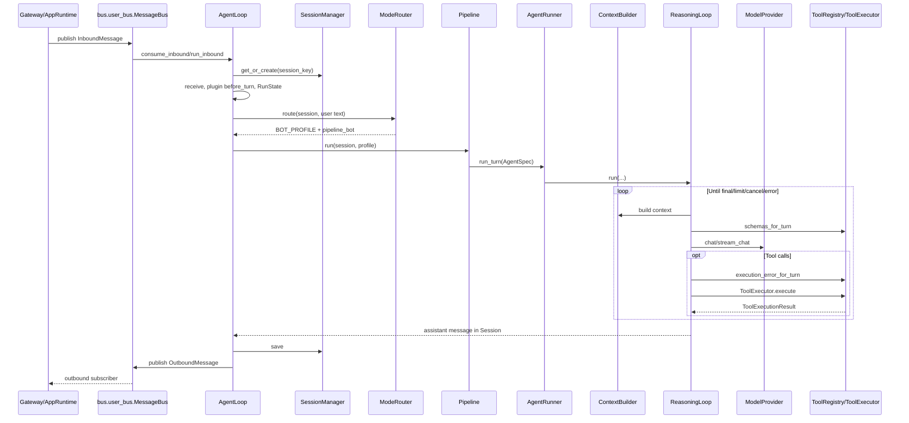
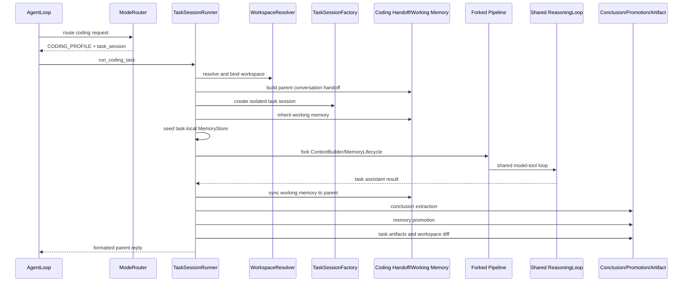
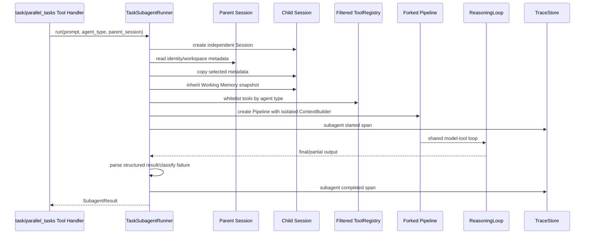
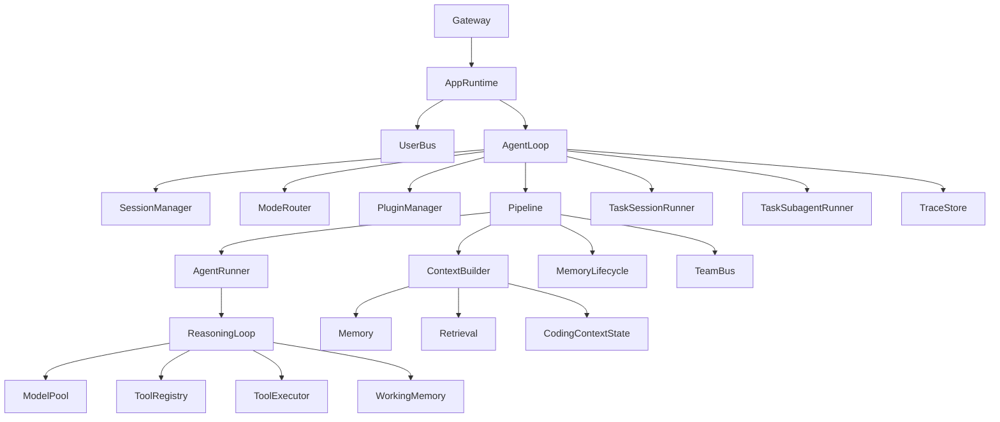

# TaleClaw Runtime Phase 0 架构与行为基线

## 1. 分析基线

| 项目 | 值 |
|---|---|
| 分支 | `main` |
| HEAD | `bb4e845571428069a78a05526e71da8e41ddbcb7` |
| 报告基线 | `bb4e845`，与当前 HEAD 一致 |
| 记录日期 | 2026-07-23 |
| 项目 Python 要求 | Python `>=3.12` |
| 本机系统 Python | Python 3.9.6，不满足项目要求 |
| 操作系统 | macOS / Darwin |
| 安装命令 | `uv sync --extra dev` 或 `pip install -e '.[dev]'` |
| 单元/集成测试 | `pytest -q`（仓库未分离单元和集成命令） |
| Coverage | 仓库未配置 coverage 工具 |
| Lint/Format/Type Check | 仓库未配置 Ruff、Black、Mypy 或等价命令 |
| CI | 当前仓库没有 `.github/workflows` |
| CLI 启动 | `python cli.py` |
| Web 启动 | `python -m web.server` |

工作区初始存在两个未跟踪文件：用户的 `.DS_Store` 和
`docs/agent-runtime-refactor-summary.md`。Phase 0 没有覆盖、删除或还原它们。

## 2. Chat 调用链



| 顺序 | 文件 | 类/函数 | 输入 | 输出 | 职责 |
|---:|---|---|---|---|---|
| 1 | `runtime/app_runtime.py` | `AppRuntime.submit_user_message/run_message` | content/channel/chat | InboundMessage | 应用入口 |
| 2 | `bus/user_bus.py` | `MessageBus` | Inbound/OutboundMessage | Queue message | Gateway dispatcher |
| 3 | `runtime/agent_loop.py` | `AgentLoop.run_inbound` | InboundMessage | OutboundMessage | turn 编排 |
| 4 | `sessions/session.py` | `SessionManager.get_or_create` | session key | Session | 会话加载 |
| 5 | `runtime/routing/router.py` | `ModeRouter.route` | Session/text | RouteResult | Mode 与 execution 选择 |
| 6 | `runtime/pipeline.py` | `Pipeline.run` | Session/Profile | final text | turn setup/context/memory |
| 7 | `runtime/agent_runner.py` | `AgentRunner.run_turn` | AgentSpec/callbacks | Session mutation | 创建共享 loop |
| 8 | `runtime/reasoning_loop.py` | `ReasoningLoop.run` | context/provider/tools | messages | model-tool 循环 |
| 9 | `runtime/context.py` | `ContextBuilder.build` | Session/Profile | ContextBundle | 最终模型输入 |
| 10 | `models/provider.py` | Provider `chat/stream_chat` | messages/tools | LLMResponse | 模型适配 |
| 11 | `tools/tool_registry.py`、`tools/executor.py` | registry/executor | ToolCall | Tool result | 筛选、授权与执行 |

`AppRuntime.run_message()` 可绕过 inbound queue 直接调用 `AgentLoop.run_inbound()`，
但成功结果仍写入 outbound queue。`run_once()` 则消费 inbound queue。因此 MessageBus
进入 CLI 的默认 `submit + run_once` 路径，也进入成功结果投递路径，但不是
`AgentLoop.run_inbound()` 前置的硬依赖。

## 3. Coding 调用链



确认当前仍存在的独立 Coding 生命周期：

- Workspace 解析与边界绑定；
- 隔离 Task Session；
-父会话 Handoff；
- Working Memory 继承与回写；
- Task-local Memory；
-动态 reasoning budget；
- Workspace 前后快照和 diff；
-结论提取；
- Memory promotion；
- Task log/conclusion artifacts；
-父会话 Coding Task Summary。

这些步骤位于 `agents/coding/runner.py:TaskSessionRunner.run_coding_task`，而实际
model-tool loop 仍复用 `Pipeline → AgentRunner → ReasoningLoop`。

## 4. Subagent 调用链



当前行为：

- 创建独立、短生命周期 `Session`；
- 只复制父 Session 的 user identity、workspace 等选定 metadata；
- Working Memory 使用 snapshot 方式继承，不继承父消息历史；
- Tool View 来源于 `SUBTASK_TOOL_WHITELIST`，通过复制 base registry 中允许项构建；
- 子 Agent 经过独立 Pipeline，但复用 provider、model pool、ToolExecutor 和 ReasoningLoop；
- Trace 使用父 RunState 派生的 span/run state 关联；
- 单个 `TaskSubagentRunner.run()` 没有接收父 cancellation callback；
- timeout 主要由 `agents/subagent/parallel.py` 的 Future/timeout 包装处理；
-错误被归一化为 `SubagentResult`，通常不向父调用直接抛出。

## 5. 核心模块依赖



## 6. Bootstrap 对象装配

```mermaid
graph TD
    build_runtime --> ModelPool
    build_runtime --> UserMessageBus
    build_runtime --> SessionManager
    build_runtime --> TraceStore
    build_runtime --> LeadToolRegistry
    build_runtime --> ModeRouter
    ModeRouter --> HybridClassifier
    build_runtime --> MemoryStores
    build_runtime --> OptionalHistoryVectorIndex
    build_runtime --> OptionalSecurityRAG
    build_runtime --> ContextBuilder
    build_runtime --> MemoryLifecycle
    build_runtime --> PluginManager
    PluginManager --> PluginTools
    PluginManager --> PluginToolHooks
    build_runtime --> ToolExecutor
    build_runtime --> OptionalReflectionAgent
    build_runtime --> Pipeline
    build_runtime --> TeamRuntime
    build_runtime --> TaskSessionRunner
    build_runtime --> TaskSubagentRunner
    build_runtime --> AgentLoop
    build_runtime --> AppRuntime
```



`build_runtime()` 还负责 `.env`、proxy、模型 health check cache、sandbox cleanup、
RAG feature flags 和全局 subagent runner 配置。Gateway 本身不在该函数内构造。

## 7. Prompt 与 Context 组成

`ContextBuilder` 当前按以下来源构造模型输入：

1. Profile system prompt；
2. Runtime guidance；
3. Mode instruction（`.agent/assistant.md` 或 `.agent/coding.md`）；
4. Coding 时的 project instructions；
5. Skill catalog；
6.长期 Memory；
7.检索历史；
8. Security RAG；
9. Working Memory；
10. Coding Context State；
11. Task runtime events；
12.会话历史；
13.当前用户请求。

`Pipeline` 还会在 active turn 前插入 Tool Catalog。Context report 记录 section 顺序、
字符数、裁剪和估算数据。Phase 0 快照固定稳定的角色顺序、section 顺序和 token
估算，不快照临时路径、时间和随机 ID。

## 8. Tool 筛选和权限路径

当前实际路径：

```text
ToolRegistry.register
→ ToolSpec.enabled_for(mode, session)
   → enabled_modes
   → admin_only
→ ToolPolicy.visible_tools
   → always-on / mode preload / per-turn unlock
→ ReasoningLoop.schemas_for_turn
→ 模型产生 ToolCall
→ ToolRegistry.execution_error_for_turn
   → ToolPolicy.can_execute
→ ReasoningLoop 构造 ToolExecutionRequest
→ ToolExecutor pre-hooks
   → FileWriteScopeHook / ToolLoopGuard / plugins
→ ToolRegistry.execute
   → 再次调用 execution_error_for_turn
   →注入 session/trace 参数
   → Handler
→ ToolExecutor post-hooks
   → result store / trace / plugins
```

已知语义：`ToolRegistry.execute` 捕获 Handler 异常并返回 `"Error: ..."` 字符串，
因此外层 `ToolExecutor` 会把该情况记录为 `status="success"`。Phase 0 测试将其作为
现有契约固定，而不是修复。

## 9. Session.metadata 主路径清单

| Key/Key 组 | 主要写入位置 | 主要读取位置 | 职责 | 生命周期 | 路径 |
|---|---|---|---|---|---|
| `user_id`, `user_role` | AgentLoop/Gateway/TaskSessionFactory | routing、tools、memory、trace | 身份与权限 | Session | 公共 |
| `last_route` | ModeRouter | trace/report/status | 路由结果 | 每 turn 更新 | 公共 |
| `active_run_id` | AgentLoop start | tools/trace | 当前 Run | Run 内，结束删除 | 公共 |
| `last_run_id` | AgentLoop finish/fail | UI/report | 最近 Run | Session | 公共 |
| `unlocked_tools` | ToolPolicy/tool_search | ToolPolicy | 本 turn Tool View | 每 turn reset | 公共 |
| `workspace_*` | WorkspaceResolver | hooks/handlers/context/subagent | Workspace 边界 | Session/Task | Coding |
| `kind` | Task/Subagent factory | pipeline/context/tools | session 类型 | Session | Coding/Subagent |
| `parent_session_id`, `parent_run_id` | Task/Subagent runner | trace/artifact/context |父子关联 | Child Session | Coding/Subagent |
| `task_id`, `status`, `task_reply` | TaskSessionRunner | artifacts/report | Coding task 状态 | Task Session | Coding |
| `task_log_path`, `conclusions_path` | TaskSessionRunner | parent summary/report | Artifact | Task Session | Coding |
| Coding handoff/summary keys | coding handoff/runner | Context/AgentLoop |父子对话传递 | Turn/Session | Coding |
| Working Memory key | working_memory helpers | context/checkpoints |任务进度 | Session | Coding/Subagent |
| Coding Context State key | coding_context_state helpers | ContextBuilder |压缩后的 Coding 状态 | Task Session | Coding |
| web search budget keys | Pipeline/ReasoningLoop | ReasoningLoop/plugins |每 turn 搜索额度 | Turn | 公共 |
| reasoning stop keys | ReasoningLoop/Pipeline | task/subagent/report |终止原因 | Turn | 公共 |
| `subagent_runner_available` | AgentLoop | tool handler/context |能力提示 | Turn/Session | Coding |
| `active_trace_*` | trace subscribers/hooks | tools/subagent | Trace 关联 | Run | 公共 |

metadata 还包含 Memory lifecycle、orchestration、benchmark 和 plugin 专用 key。完整
静态搜索可使用：

```bash
rg 'metadata\[(\"|'\"'\"')|metadata\.get\((\"|'\"'\"')|metadata\.pop\((\"|'\"'\"')' \
  runtime agents tools modes plugins
```

## 10. MessageBus 职责

| Bus | 文件 | 生产者 | 消费者 | 消息类型 | 默认单 Agent 路径 |
|---|---|---|---|---|---|
| User MessageBus | `bus/user_bus.py` | AppRuntime/Gateway | AgentLoop/outbound subscribers | InboundMessage、OutboundMessage | 是；`run_once` 消费 inbound，所有成功请求发布 outbound |
| Team MessageBus | `bus/team_bus.py` | lead/teammate tools | lead/teammates/ContextBuilder | 本地 JSON mailbox | 否；仅 task-session/multi-agent 路径读取 |
| ReliableMessageBus | `bus/reliable.py` | multi-agent protocol | registered handlers | AgentMessage | 否 |

## 11. 已知复杂度和 Phase 1 风险

- Prompt section 顺序和 Tool Catalog 插入位置容易回归；
- `enabled_modes + admin_only + visibility + hooks` 任一迁移都可能改变授权；
- `Session.metadata` 是多个模块的隐式集成接口；
- Coding 的 Task Session 和父 Session 使用不同消息与 Memory 生命周期；
- Subagent 不继承完整对话，也没有直接父 cancellation callback；
- Streaming 当前包含 Provider 文本 chunk、Web NDJSON delta 和 Trace projection 三套层次；
- Tool handler 异常的当前状态归一化不直观；
- Bootstrap 会加载可选外部依赖，不适合作为纯微基准直接构建。

## 12. 补充行为基线

本轮后续补充确认：

- Model → Tool → Model 的稳定 Trace 事件序列保存在
  `tests/snapshots/runtime_phase0_trace_events.json`；
- cancellation 在同步 Tool Handler 执行期间不会中断 Handler，而是在 Tool 完成后的
  下一轮循环入口被观察；
-长期 Memory 作为单独的 `user` context message 插入 system message 与当前用户
  请求之间；
- `TaskSessionFactory` 创建独立 Session 和独立 Memory Root，不自动复制父 Session
  的 workspace metadata；workspace 由后续 `TaskSessionRunner` 显式绑定；
- Subagent 使用独立 Session、Agent Type Tool 白名单和结构化结果，不复制父消息
  历史原文。

本文件只记录当前行为，不实施上述边界的调整。

## 13. 遗留项闭环

- 使用 `InMemorySessionManager` 测试替身跑通完整
  `TaskSessionRunner.run_coding_task`，覆盖隔离 Session、Handoff、Pipeline、
  Conclusion、Artifact、Memory Promotion、Workspace Diff 和最终 Trace。
- 完整 Coding 生命周期事件固定在
  `tests/snapshots/runtime_phase0_coding_lifecycle_events.json`。
- Telegram、Feishu Outbox 的发送失败重试与终止状态固定在
  `tests/snapshots/runtime_phase0_gateway_delivery_failures.json`。
- Tool Handler 仍是同步、非抢占式执行；这是已固化的现有契约，不再是测试缺口。
- PostgreSQL 仍是生产 Store 的强制依赖；离线 scripted Coding Benchmark 仅在测试
  装配中替换 SessionManager，不为生产环境增加隐式内存降级。
