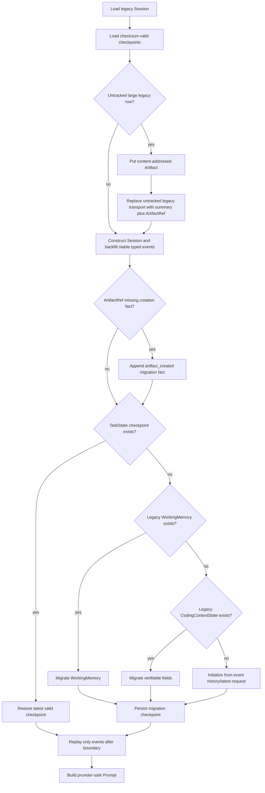

# TaskState Context Migration Runbook

状态：适用于 2026-07-29 TaskState 上下文架构

架构说明：[`TASK_STATE_CONTEXT_ARCHITECTURE.md`](../architecture/TASK_STATE_CONTEXT_ARCHITECTURE.md)

本 Runbook 将旧 Session message、WorkingMemory 和 CodingContextState 迁移到 Event Log、
ArtifactStore 和唯一权威 TaskState。迁移是 additive、lazy、幂等的：不删除旧消息、不改写原始
Event Log，也不在升级过程中物理删除旧 metadata 字段。

## 1. 迁移原则

1. 先备份并记录计数/checksum，再部署 additive schema。
2. 原始事件和大型正文必须先持久化，之后才能写引用和推进 checkpoint boundary。
3. 已有 checkpoint 优先于 metadata；TaskState 一旦存在，旧状态不再成为写入目标。
4. 同一 legacy message、Artifact 内容和已迁移 state 重复加载不得生成重复事实。
5. 迁移 checkpoint 成功前，Session 保持旧 boundary；失败可无损重试。
6. 回滚只切换装配路径，不删除 Event、Artifact 或 checkpoint。

## 2. 升级前盘点

记录当前提交、工作树和相关配置：

```bash
git rev-parse HEAD
git status --short
printenv CONTEXT_ARTIFACT_ROOT TASK_STATE_CONTEXT_ENABLED SEMANTIC_COMPACTION_ENABLED ARTIFACT_OFFLOADING_ENABLED DYNAMIC_PROMPT_BUDGET_ENABLED
```

数据库连接目标在受保护的变更记录中核对，不要把含凭据的 DSN 打印到终端日志。

对 Session 数据库执行平台标准的只读快照/备份。至少记录：

- Session、message 总数和每个 Session 最大 message 大小；
- 已存在的 `context_events`、`context_checkpoints` 表/行数；
- metadata 中含 `working_memory` 或 legacy `coding_context_state` 的 Session 数；
- Artifact 根目录的文件清单、字节数和 checksum；
- 当前四个 feature flag 值。

不要为了“清理”迁移源而更新 message JSON 或删除 metadata。旧数据是回滚和审计依据。

## 3. Schema 与存储升级

`SessionStore` 初始化会幂等创建：

```text
context_events
context_checkpoints
idx_context_events_session_seq
idx_context_checkpoints_session_boundary
```

原 `sessions` 和 `messages` 表保留。ArtifactStore 在 `CONTEXT_ARTIFACT_ROOT` 下幂等创建：

```text
content/<sha256>
metadata/art_<sha256>.json
```

部署后先启动一个不承载生产流量的进程两次，确认 schema 初始化和 Artifact 目录创建可重复。
数据库账号需要新增/查询上述表的权限，运行账号需要 Artifact root 的创建、读、写和原子 rename/link
权限。

## 4. Feature flag rollout

代码默认全部开启：

```dotenv
TASK_STATE_CONTEXT_ENABLED=1
SEMANTIC_COMPACTION_ENABLED=1
ARTIFACT_OFFLOADING_ENABLED=1
DYNAMIC_PROMPT_BUDGET_ENABLED=1
```

新部署应保持这组默认值。若必须分批观察，只允许在隔离环境按以下顺序验证，不允许长期双写：

1. ArtifactStore + Event Log 持久化；
2. TaskState migration/projection；
3. Semantic StatePatch compaction；
4. provider-aware assembly 和调用前 hard guard。

`DYNAMIC_PROMPT_BUDGET_ENABLED` 在生产 rollout 中应保持开启，以启用 provider-aware 上游装配。
最终调用前 hard guard 是无条件运行时不变量，不受该开关控制；旧字符预算不能替代这个安全边界。

## 5. 单个 Session 的幂等迁移流程

迁移由 Session 首次加载/首次 Coding context 构造触发，不要求一次性停机重写全部数据。



### 5.1 Legacy messages -> Event Log

`Session.__post_init__()` 和 `_backfill_legacy_messages()` 为尚未跟踪的旧 message 创建 typed event：

- user -> `user_message`，显式 correction -> `user_correction`；
- assistant with tool calls -> `tool_call`；
- tool -> `tool_result`；
- runtime error metadata -> `runtime_error`；
- 其余 assistant -> `assistant_message`。

有原 timestamp 时沿用；没有时使用基于 message index 的稳定 epoch timestamp。`event_id` 由 Session、
seq、type、timestamp 和 payload 派生。同一份 messages 重复构造 Session 得到同一 event IDs。旧
`messages` 行不会删除。

### 5.2 Legacy 大型 message -> Artifact

对超过 `LONG_CONTENT_MAX_TOKENS` 或字符/字节 guard 的正文：

1. `SessionManager` 在构造 Session 和 backfill event 之前扫描尚未被 Event Log 跟踪的 legacy row；
2. 将原字节写入 ArtifactStore，并验证返回 `content_hash`；
3. 用短指令/摘要和顶层 `ArtifactRef` 替换该 legacy transport row；
4. `Session.__post_init__()` 由替换后的 row 创建稳定 typed event，因此新 message event 不含全文；
5. SessionManager 为尚未记录的 ArtifactRef 追加 `artifact_created` migration fact；
6. `SessionStore.save_session()` 成功后才视为该条完成迁移。

幂等性由“是否已有匹配 immutable event”和内容 hash 共同保证。重复加载时 row 已由 event 跟踪，
不会再次迁移；重复写相同正文也只返回同一 `art_<sha256>`。若 Artifact 写失败，不保存
replacement、不 backfill 引用 event，也不推进 checkpoint boundary。

若正文在迁移前已经进入不可变 Event Log（包括绕过标准 AgentLoop 的旧嵌入调用），迁移不能原地
改写或删除该审计事件。此时系统追加一个只含 ArtifactRef 的安全 replacement event，并写入
`legacy_message_replaced` fact；Active Event Window 和 Prompt 视图排除被替代的 raw event。旧 raw
event 只在审计保留期内存在，属于 legacy 数据治理边界；新入口始终先外置再创建 message event，
不会产生这份历史重复。

标准 `runtime/bootstrap.py` 会把共享的 `LongContentDetector` 注入 `SessionManager`。自定义嵌入或
测试若直接构造 `SessionManager`，也必须传入 detector；未传时只做事件 backfill，不会执行大型
legacy row 外置。

### 5.3 WorkingMemory -> TaskState

映射规则：

| WorkingMemory | TaskState | 规则 |
|---|---|---|
| `objective` | `objective.summary` | 最多 480 chars；原文由 latest user `event://`/ArtifactRef 持有 |
| `completed_units` | `completed` | 保留稳定 unit ID、结论和 evidence refs |
| `pending_units` | `pending_actions` | 映射 priority/status；保留 scope/blocking 信息 |
| `observed_calls` | `execution_memory.observed_tools` | 有界保留，不复制大型 tool result |
| `step_checkpoints` | `execution_memory.step_checkpoints/last_step` | 保留最近可恢复步骤 |
| `archived_findings` | `hypotheses` | 没有 EvidenceRef 的旧 finding 一律降级 |
| completed status | `phase=finalization` | 未完成旧任务默认进入 `exploration` |

迁移函数是纯映射；相同 payload 产生相同稳定 item IDs 和 state 内容。TaskState 保存成功后删除
metadata 中独立 `working_memory` 写副本。旧 WorkingMemory API 此后从 TaskState 投影，任何兼容写
也归约到 TaskState。

### 5.4 CodingContextState -> TaskState

| Legacy CodingContextState | TaskState | 规则 |
|---|---|---|
| short objective/finish condition | `objective` | 只保留有界摘要和 request ref，不复制原请求 |
| `evidence_index` | `evidence_index` | 保留 event/tool/artifact/path 等可验证引用 |
| finding with valid refs | `findings` | 所有 refs 必须在迁移后的 index 中存在 |
| finding without valid refs | `hypotheses` | 标注 migrated unsupported，不声称为事实 |
| pending actions | `pending_actions` | 保留稳定 ID 和合法 status |
| open questions | `open_questions` | 分配稳定 legacy ID |
| coverage | `coverage.entries` | 只迁移已有明确 coverage，不扩展声称 |
| `do_not_repeat` | `execution_memory.do_not_repeat` | 有界保留，后续由结构化 fingerprint/result hash 取代 |

原 `CodingContextState` 此后只重建为 generation/boundary/renderer snapshot，不再更新上述事实字段。

### 5.5 没有旧状态的 Session

如果没有有效 checkpoint、WorkingMemory 或 CodingContextState：

- objective 取最新真实 user event 的短摘要；
- `original_request_ref` 指向稳定 `event://...`；
- 大型源只加入 `source_artifacts`/`artifact_refs`；
- 其余事实由 checkpoint 边界后的事件重新提取，不从旧摘要猜测 finding。

初始 state 也必须持久化 migration/initial checkpoint。只有 checkpoint、对应完成事件和 boundary
在同一持久化事务中成功后，迁移才算完成。migration checkpoint metadata 使用
`kind=legacy_task_state_migration`，并保存 `source`、`source_sha256`、`task_state_sha256` 和
TaskState schema version，重复来源 hash 不会生成第二个 checkpoint。

## 6. Checkpoint 与恢复验证

普通 compaction checkpoint 应验证：

- `generation` 与 TaskState `execution_memory.compaction_generation` 一致；
- `source_event_start_id` / `source_event_end_id` 在 Event Log 中存在且有序；
- `compacted_until_event_id` 对应安全 boundary，不穿过未闭合 tool call；
- `artifact_refs` 均能读取且 hash 匹配；
- TaskState checksum 和 SessionStore `state_sha256` 有效；
- boundary 后的事件没有包含在旧 checkpoint source range 中。

WorkingMemory/CodingContextState migration checkpoint 不压缩新事件范围，因此保持迁移前 boundary，
并改为验证 `migration.source`、legacy payload SHA-256、TaskState SHA-256 和 schema version。它和
对应 `task_state_checkpoint`/`compaction_completed` 事件仍由同一 SessionStore transaction 保存。

重启测试应关闭原 SessionManager/数据库连接，重新构造 store 后加载 Session，而不是复用进程内对象。
加载器跳过 checksum 不匹配的 checkpoint，使用下一个最新有效 checkpoint；若都无效，则保留 Event
Log 并重新执行迁移，不得使用损坏 boundary。

## 7. 失败处理

| 失败点 | 预期结果 | 重试方式 |
|---|---|---|
| Artifact content/metadata 写失败 | 原 message/state 不改，boundary 不前进 | 修复存储后重试同一正文 |
| Semantic provider 失败 | 最多重试一次；仍失败保留旧 state/boundary | 恢复 provider 后重压同一 event range |
| StatePatch 验证失败 | 不应用 patch，记录 validation failure | 修复 compactor/schema 后重压 |
| Checkpoint insert 失败 | DB transaction 回滚，移除本次内存 completion events | 重试整个 compaction transaction |
| DB commit 失败 | state/boundary 不对外可见 | 恢复数据库后从旧 checkpoint 重试 |
| Checksum mismatch on load | 跳过损坏 checkpoint，不采用其 boundary | 从前一有效 checkpoint + later events 恢复 |
| ArtifactRef 读取失败/hash mismatch | 不把证据注入 Prompt，记录明确错误 | 恢复 Artifact 备份，不猜测原文 |
| Hard token guard block | provider 调用数保持 0，增加 `hard_budget_blocks` | 外置/减少低优先级证据后重新装配 |

## 8. 验证命令

先运行迁移和核心单元/集成测试：

```bash
PYTHONPATH=. pytest -q \
  tests/test_artifact_store.py \
  tests/test_long_content.py \
  tests/test_context_event_log.py \
  tests/test_task_state_core.py \
  tests/test_task_state_compaction.py \
  tests/test_coding_context_state.py \
  tests/test_working_memory_resume.py \
  tests/test_dynamic_prompt_budget.py
```

然后运行 Coding 去重、工具结果和最终 token gate 回归：

```bash
PYTHONPATH=. pytest -q \
  tests/test_coding_handoff.py \
  tests/test_context_budget.py \
  tests/test_reasoning_loop_token_gate.py
```

数据库 backend 测试若因本地 PostgreSQL 不可用而 skip，必须在部署环境用真实 DSN 重跑，重点验证
`context_events` append-only、checkpoint transaction、重启 boundary 和 checksum fallback。

## 9. 手动验收

对隔离 Session 执行以下步骤并保存输出/metrics：

1. 发送包含短指令和 500,000 字符正文的 coding request。
2. 确认 ArtifactStore 只有一个匹配 content hash，且可 `read_artifact_range` 精确读取中段。
3. 检查 Session message、Event payload、handoff、TaskState、metadata 和 Task Memory；不得出现完整正文。
4. 检查最终 Prompt，短指令和 ArtifactRef 可用，完整正文不存在，当前请求只出现一次。
5. 连续制造至少两代 closed conversation/tool groups 并触发 compaction。
6. 确认 generation 递增、source ranges 不重叠、未闭合 tool call 留在 Active Event Window。
7. 终止并重启进程，确认 TaskState、boundary、later events 和 ArtifactRef 全部恢复。
8. 使用小 context-window fake/provider 触发硬超限，确认 provider spy 的调用数为 0。

可用以下只读搜索检查大型原文是否泄漏；`UNIQUE_SENTINEL` 应只出现在 Artifact content 中：

```bash
rg -l 'UNIQUE_SENTINEL' .coding_applications memory 2>/dev/null
rg -n 'UNIQUE_SENTINEL' /tmp/taleclaw-session-export 2>/dev/null
```

对数据库中的 message/event/metadata 应使用结构化 JSON 查询或导出后检查，不能只检查 Prompt trace。

## 10. Rollback

Rollback 不删除新数据，也不把旧 WorkingMemory/CodingContextState 重新设为并行权威：

1. 通常保持 `DYNAMIC_PROMPT_BUDGET_ENABLED=1` 以保留动态装配；即使诊断时关闭，上游最终 hard guard 仍继续工作。
2. 暂停新 semantic compaction 时可临时设置 `SEMANTIC_COMPACTION_ENABLED=0`；已提交 TaskState 保留。
3. 若 Artifact 外置路径故障，先停止接收大型输入并恢复 Artifact 存储；不能让正文重新进入 Prompt。
4. 必须临时关闭 TaskState context 时，先停止 Coding 流量并保留 checkpoint/Event Log；不要启动双写。
5. 回滚应用版本后保留 `context_events`、`context_checkpoints` 和 Artifact root，旧版本可忽略 additive 数据。

禁止：

- DROP 新表或删除 Artifact root；
- 回退 `archive_boundary_seq` 后把已归档 legacy history 直接重新注入 Prompt；
- 把 checkpoint TaskState 反向覆盖到 WorkingMemory/CodingContextState 两份状态；
- 关闭 hard guard 后继续承载生产模型调用；
- 为“修复”引用而修改旧 Event payload。

## 11. Cleanup 条件

本次迁移不物理清理 legacy messages、旧 metadata、Event 或 Artifact。永久删除必须另开数据治理变更，
并同时满足：

- 全量 Session migration 报告和失败重试清零；
- 至少一个观察周期没有 TaskState rollback；
- 多代 compaction、重启和 checksum 恢复已在真实 backend 验证；
- 500k 输入和大型工具结果不存在重复正文；
- Artifact 有备份、retention 和 orphan GC 方案；
- 审计/合规保留期得到批准；
- 全部相关测试通过并保存结果。

在此之前，旧字段可以停止读取并标记 deprecated，但不能作为上下文压缩的副作用被删除。
