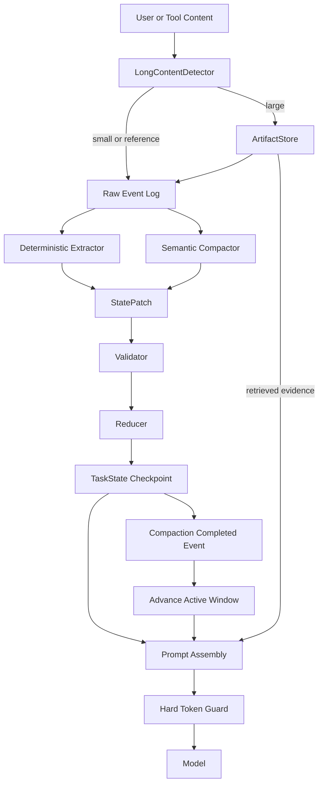
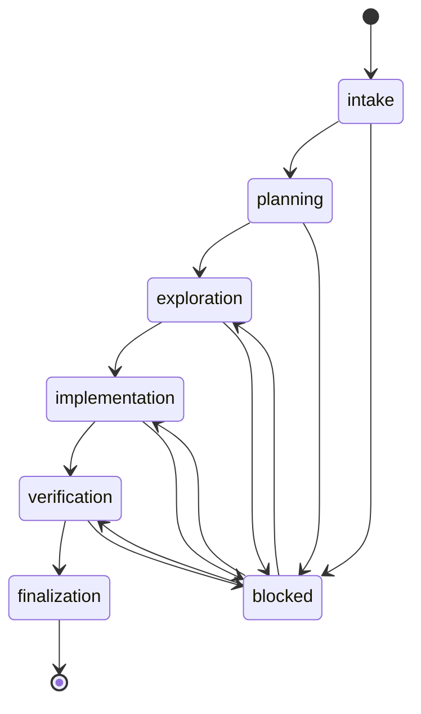

# TaskState Context Architecture Plan

## Architecture Overview

The runtime records typed `ContextEvent` objects with stable IDs. Bodies exceeding the long-content thresholds are first placed in `ArtifactStore`; events retain only a summary and `ArtifactRef`. `TaskState` is updated by deterministic runtime transitions and validated semantic `StatePatch` objects. `CompactionCoordinator` checkpoints the reduced state and advances its stable event boundary only after every write succeeds. `PromptAssembler` renders TaskState plus a token-selected recent raw tail, current tool transaction, latest user message, and retrieved evidence. `HardTokenGuard` is the last gate before provider invocation.

## Core Data Structures

- `ArtifactMetadata` / `ArtifactRef`: immutable content identity, storage URI, parse state, size, hash, and safe summary.
- `ContextEvent`: event ID, session ID, sequence, type, timestamp, payload, artifact refs, and archive generation.
- `TaskState`: versioned authoritative state with finite phases and structured execution/coverage memory.
- `StatePatch`: additive and transition-oriented semantic changes; never a complete state rewrite.
- `ContextCheckpoint`: generation, state version, stable source range, boundary, artifact refs, checksum, and timestamp.
- `DynamicPromptBudget`: model window less system, tools, output reserve, and safety margin, with soft/target/hard limits.

## Modules

- `runtime/context/artifacts.py`: content-addressed filesystem/SQLite artifact operations.
- `runtime/context/long_content.py`: token-first detection and message externalization.
- `runtime/context/events.py`: event typing, grouping, active-window selection, and stable references.
- `applications/coding/task_state.py`: schema, persistence adapters, runtime transitions, and legacy migration.
- `applications/coding/compaction.py`: extractor, semantic compactor, patch validator/reducer, checkpoint transaction.
- `runtime/context/dynamic_budget.py`: budget calculation, prompt accounting, and hard guard.
- Existing Session, coding runner/handoff, context builder, and reasoning loop modules become integration points.

## Interaction

## State Update Flow

## Technical Decisions

| Decision | Choice | Rationale |
|---|---|---|
| Artifact identity | SHA-256 content addressing | Deduplicates bodies and makes references verifiable. |
| Event boundary | Stable event ID plus monotonic sequence | Survives list changes and supports efficient ordered selection. |
| Semantic updates | JSON StatePatch | Makes validation and deterministic reduction possible. |
| Persistence migration | Additive tables and lazy idempotent conversion | Preserves old data and limits upgrade risk. |
| Prompt limits | Provider-aware token estimator plus hard exception | Existing provider adapters expose model windows and estimators. |
| Legacy context state | Read-only compatibility renderer backed by TaskState | Avoids two authoritative mutable states. |

